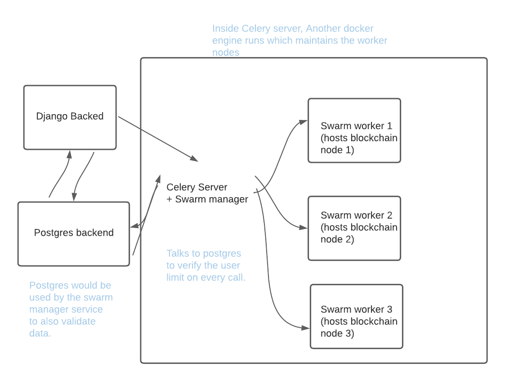

# urNode

[](https://github.com/argusOSS/urNode/releases)
[](https://github.com/argusOSS/urNode/stargazers)
[](https://github.com/psf/black)
[](https://pycqa.github.io/isort/)
[](https://github.com/argusOSS/urNode/actions/workflows/codeql-analysis.yml)
[](https://github.com/argusOSS/urNode/actions/workflows/dependency_review.yml)
[](https://github.com/argusOSS/urNode/actions)

Project still in development. Expect the backend and frontend to be ready in a couple of weeks.

## Installations

This project aims to be as fast to spin up as possible. And thus, if you have the appropriate utility installed (<a href="https://docs.docker.com/compose/install/">docker-compose</a> & <a href="https://docs.docker.com/engine/install/">(docker cli + engine)</a>, It would be as simple as a:

```
    docker-compose up
```

## Project architecture

Some notes you might not need to worry about if you're not a nerd, The project uses <a href="https://docs.docker.com/engine/swarm/">docker swarm</a> along with other compose nodes. 

The default assumpton here is that you don't want to be deal with the hassle that docker clis come with. So, for the time being, we support creation of a swarm manager automatically. It is a full fleged service of it's own which manages a docker swarm when the backend asks it to. It is made so that you don't have to worry much about what runs under the hood which also happens to be the celery server.

Here is how the project architecture looks like currently:



## Future prospects

We wish to look forward to being able to automate spinning up a kubernetes network from a couple commands and provide support for existing k8s and docker swarm networks.

