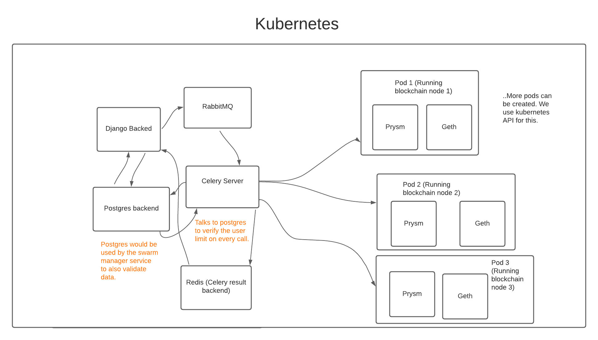

# urNode

[](https://github.com/argusOSS/urNode/releases)
[](https://github.com/argusOSS/urNode/stargazers)
[](https://github.com/psf/black)
[](https://pycqa.github.io/isort/)
[](https://github.com/argusOSS/urNode/actions/workflows/codeql-analysis.yml)
[](https://github.com/argusOSS/urNode/actions/workflows/dependency_review.yml)

Project still in development. Expect the backend and frontend to be ready in a couple of weeks.

## Installations

This project aims to be as fast to spin up as possible. And thus, if you have the appropriate utility installed (<a href="https://docs.docker.com/compose/install/">docker-compose</a> & <a href="https://docs.docker.com/engine/install/">docker cli + engine</a>.

Before going further with any of the two steps, Install <a href="https://kubernetes.io/docs/tasks/tools/">Kubectl</a> to make it easier for you to interact with the kubernetes cluster.

Also, Now the next steps are divided into two categories:

### 1. If you are trying to host it locally:
We will use <a href="https://minikube.sigs.k8s.io/docs/start/">minikube</a> for this process. Don't worry, kubernetes isn't that scary it won't haunt you too hard.

We recommend using minikube with docker. So do:

```
minikube start --driver=docker
```

And you should now have your local k8s environment ready to go.

```
docker-compose up
```

## Project architecture

Some notes you might not need to worry about if you're not a nerd, The project uses <a href="https://kubernetes.io/">Kubernetes</a> to deploy the blockchain nodes. 

Here is how the project architecture looks like currently:



